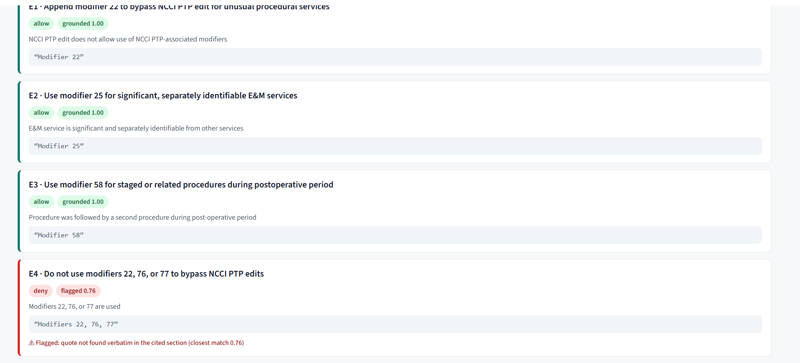
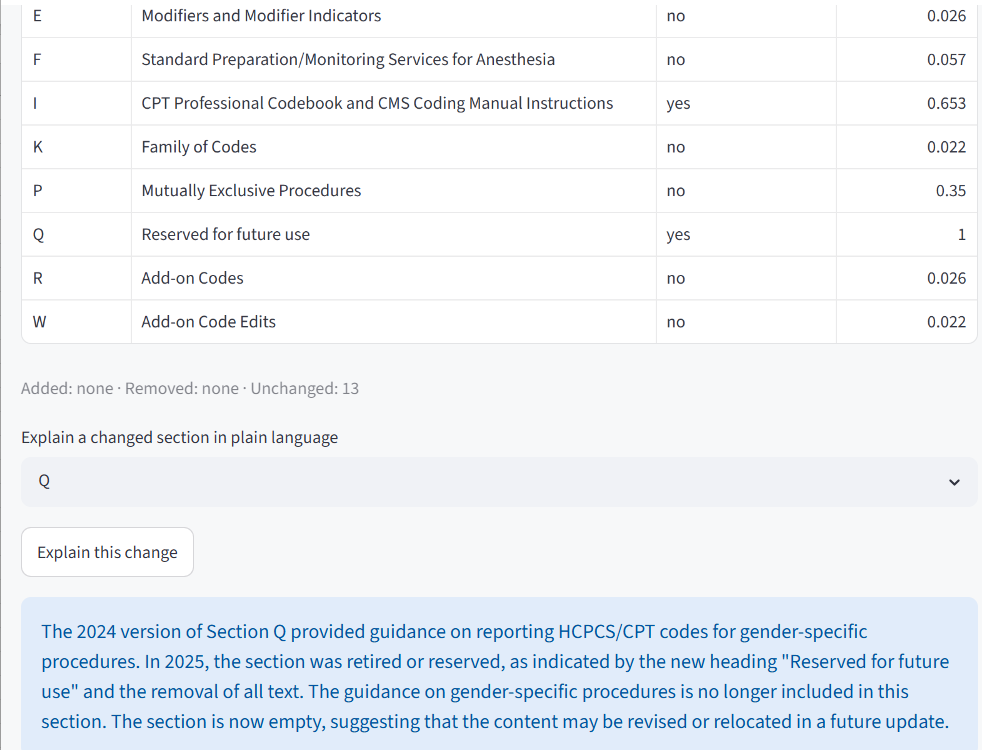
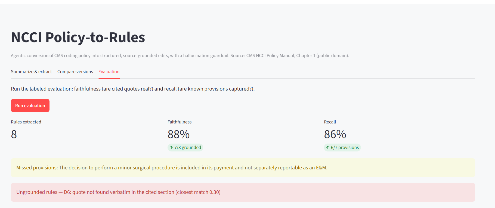

# NCCI Policy-to-Rules

An agentic system that converts written CMS coding policy into structured, source-grounded payment-integrity rules, with a built-in hallucination guardrail.

Built for the Cotiviti GenAI intern assessment (topic: Content Management in Health Care).

---

## Demo video

A recorded walkthrough covering the overview, a live demo, and the results: https://drive.google.com/file/d/1gAzEj2hbBlHoEXbLdnQwbmdzs0RC_r9f/view?usp=sharing

---

## Quickstart

```powershell
python -m venv .venv; .venv\Scripts\Activate.ps1    # see Setup if PowerShell blocks this
pip install -r requirements.txt
copy .env.example .env                               # then set GROQ_API_KEY in .env
streamlit run app.py
```

The parsed policy data is committed, so the app runs right after these four steps. Full details, including macOS and Linux commands, are in [Setup](#setup) below.

---

## What this is

Healthcare coding policy is written as prose, but a claims adjudication engine can only act on logic: a condition, an action, and a source. This project is a proof of concept that reads a section of the CMS National Correct Coding Initiative (NCCI) Policy Manual, extracts structured coding rules from it, and verifies every rule against the source text before trusting it. It also compares two editions of the manual and reports what changed.

The core idea: keep a human expert in the loop, but change their job from authoring rules by hand to verifying machine-extracted, source-cited drafts.

---

## What it does

1. **Summarize.** Produces a plain-language summary of any policy section.
2. **Extract and verify.** Extracts structured rules (condition, action, source quote) and runs a deterministic grounding check that confirms each rule's quote actually appears in the cited section. Grounded rules are marked green; unsupported ones are flagged red.
3. **Compare versions.** Diffs the 2024 and 2025 editions section by section and surfaces real changes, with an option to have the model explain a specific change in plain language.

The grounding check is the differentiator: in payment integrity, a hallucinated rule is a compliance failure, so the system separates generation from verification.

An extracted rule looks like this:

```json
{
  "rule_id": "D3",
  "description": "An E&M service that results in the decision for major surgery is separately reportable.",
  "condition": "E&M performed the day of or the day before a 090-day global procedure, for the decision to operate",
  "action": "allow",
  "source_section": "D",
  "source_quote": "separately reportable with modifier 57"
}
```

The `source_quote` is what the grounding check verifies against the cited section.

---

## How it works

```
CMS NCCI Policy Manual  ->  Agent (retrieve, extract)  ->  Grounding check  ->  Structured rules + version diff
```

The tools that retrieve, look up, and diff policy sections are plain, deterministic Python (no LLM, no network). The model only decides which tool to call and extracts the rules. A separate deterministic function then checks each rule's quote against the source.

The pipeline is model-agnostic. It runs on a free open model by default (Llama 3.3 70B via Groq) and can target any tool-calling model by changing one environment variable.

---

## Repository structure

```
cotiviti-policy-to-rules/
|-- app.py                  Streamlit UI (3 tabs: Summarize/extract, Compare, Evaluation)
|-- requirements.txt        Python dependencies
|-- .env.example            Template for the API key (copy to .env)
|-- .gitignore              Keeps .env and raw PDFs out of the repo
|-- README.md               This file
|-- Report.docx             2-page written report + references
|-- Slides.pptx             Presentation deck
|-- src/
|   |-- ingest.py           Step 1: download + parse the NCCI manual into sections
|   |-- tools.py            Deterministic tools the agent calls (search, get, diff)
|   |-- agent.py            The tool-calling agent + grounding verification
|   |-- evaluate.py         Labeled evaluation: faithfulness + recall
|-- eval/
|   |-- labeled_provisions.json   Hand-labeled ground truth for the evaluation
|-- data/
    |-- processed/          Parsed policy sections, committed so the app runs out of the box
        |-- 2024.json
        |-- 2025.json
    (data/raw/ holds the downloaded PDFs and is gitignored)
```

---

## Setup

### Prerequisites

- **Python 3.12** (a stable release, not a beta).
- A **free Groq API key** from https://console.groq.com/keys (no credit card required).
- Git, if you are cloning the repository.

### Steps (Windows PowerShell)

```powershell
# 1. Get into the project folder
cd cotiviti-policy-to-rules

# 2. Create and activate an isolated environment
python -m venv .venv
.venv\Scripts\Activate.ps1
# If PowerShell blocks the activate script, run this once, then re-activate:
# Set-ExecutionPolicy -ExecutionPolicy RemoteSigned -Scope CurrentUser

# 3. Install dependencies
pip install -r requirements.txt

# 4. Set up your API key
copy .env.example .env
notepad .env       # set GROQ_API_KEY=your_real_key, then save and close
```

On macOS or Linux, the only differences are the activation line (`source .venv/bin/activate`) and copying the env file (`cp .env.example .env`).

Your prompt should show `(.venv)` once the environment is active. The `.env` file is gitignored, so your key is never committed.

---

## Running it

The parsed policy data is committed under `data/processed/`, so the app and evaluation work immediately after setup. The steps below let you refresh the data or run each component on its own.

### Refresh the policy data (optional)

```powershell
python src\ingest.py
```

Downloads Chapter 1 of the 2024 and 2025 NCCI manuals, extracts the text with `pdfplumber`, strips page footers, and splits each edition into its lettered sections (A through W). It prints a per-section summary and writes `data/processed/2024.json` and `2025.json`. This step needs internet access.

### Check the deterministic tools (no API key needed)

```powershell
python src\tools.py
```

Runs a self-demo of the search and diff tools against the parsed data. You should see the Modifiers section rank top for a modifier query, and the diff report real changes between editions.

### Run the agent from the command line

```powershell
python src\agent.py
```

Fetches a policy section (the Evaluation and Management section by default), shows the agent's tool calls live, extracts structured rules, and prints each rule with its action, grounding score, and source quote, ending with a faithfulness rate. Requires `GROQ_API_KEY` in `.env`.

### Run the evaluation

```powershell
python src\evaluate.py
```

Scores the agent against the hand-labeled provisions in `eval/labeled_provisions.json`, reporting faithfulness (how many extracted rules are grounded) and recall (how many gold provisions were captured), plus a short failure analysis.

### Launch the app

```powershell
streamlit run app.py
```

Opens the interface in your browser. This is the main way to explore the system, and the feature tour below walks through every tab.

Note: the **Summarize** and **Extract rules** actions call the Groq API live, so they need `GROQ_API_KEY` set and internet access. The **Compare versions** tab and the deterministic tools run fully offline.

---

## Feature tour

Open the app with `streamlit run app.py`. There are three tabs.



### Tab 1: Summarize and extract

- Pick a policy **version** (2024 or 2025) and a **section** from the dropdown.
- **Summarize** returns a plain-language summary of that section.
- **Extract rules** runs the agent. It returns a list of structured rules, each shown as a card with its condition, action (allow, deny, flag, or review), and source quote.
- Each rule carries a **grounding badge**: a green badge means the rule's quote was found verbatim in the cited section; a red badge means it could not be grounded and is flagged for review. A **faithfulness metric** at the top shows the share of rules that grounded.
- Seeing a red flag is not a failure of the demo. It is the guardrail doing its job, refusing to trust a rule it cannot trace to the source.



### Tab 2: Compare versions

This tab is change-detection: because CMS revises the manual every year, a section that changed is the signal that any coding rule built on it may need review. The tab turns that into an explicit, reviewable list.

- Runs a section-by-section diff between the 2024 and 2025 editions.
- Shows which sections changed, including heading changes (for example, Section Q went from "Gender-Specific Procedures" to "Reserved for future use," a real retirement that should trigger a rule update) and a text-change score for shared sections.
- **Explain this change** asks the model to describe a selected change in plain language, grounded in the two versions of the text, so a reviewer can decide quickly whether a rule needs to change.



### Tab 3: Evaluation

- Runs the labeled evaluation and displays **faithfulness** and **recall** as metric cards.
- Lists the **failure analysis**: any provisions that were missed, and any extracted rules that were flagged as ungrounded.
- This is the honest, measurable view of how the system performs, not a single cherry-picked number.

---

## Configuration

Environment variables (set in `.env`):

- `GROQ_API_KEY` (required): your Groq API key.
- `GROQ_MODEL` (optional): the model to use. Defaults to `llama-3.3-70b-versatile`.

To run on a different model, change `GROQ_MODEL`. Because the pipeline is model-agnostic, the same code works against any tool-calling model with no other changes.

---

## Results

On a hand-labeled set of seven provisions from the Evaluation and Management section, the agent reached 100 percent on both faithfulness and recall on some runs. Because the model is non-deterministic, performance varies, so a representative run is reported at roughly 88 percent faithfulness and 86 percent recall. Reporting this range, rather than a single best run, is the honest characterization, especially given the deliberately small evaluation set. See `Report.docx` for the full write-up.

---

## Limitations and future work

- Retrieval uses keyword matching today; semantic embeddings are the natural next step.
- The evaluation set is small, so this is a feasibility signal, not a production accuracy claim.
- The proof of concept covers Chapter 1 of the manual; the approach generalizes to the full manual and other policy sources.
- A dedicated trained model (for example, to route a claim to the right section or predict the edit action) was considered but deliberately deferred. The goal was to stay within the actual ask of a working proof of concept, and the agent plus grounding already proves feasibility without training. A trained model becomes a natural version two once the workflow runs at scale and produces verified, labeled data.

---

## Deliverables

- `Report.docx`: the two-page written report with references.
- `Slides.pptx`: the presentation deck.
- A recorded [video walkthrough](https://drive.google.com/file/d/1gAzEj2hbBlHoEXbLdnQwbmdzs0RC_r9f/view?usp=sharing) of the project and a live demo.
- This `README.md`: setup, run instructions, and the feature tour.
- The source code under `src/`, the labeled evaluation under `eval/`, and the parsed data under `data/`.

---

## Data source and license

The policy text comes from the CMS National Correct Coding Initiative (NCCI) Policy Manual, a public-domain US government document. Source: https://www.cms.gov/medicare/coding-billing/national-correct-coding-initiative-ncci-edits/medicare-ncci-policy-manual

---

## Author

Keshav Girish Adkar, Northeastern University
adkarkeshav@gmail.com
